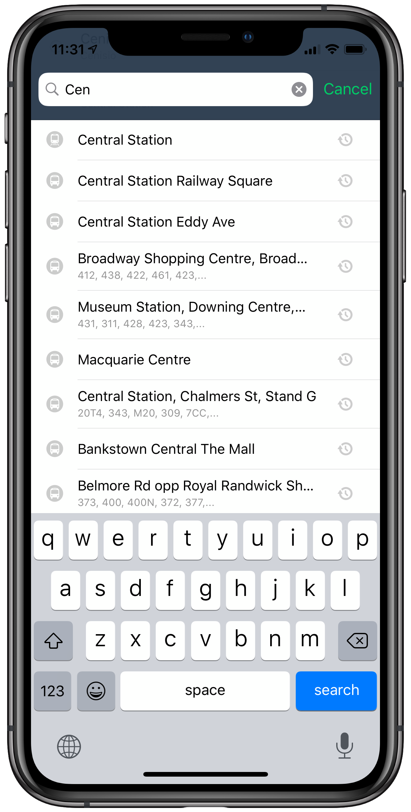

# View Controllers of TripKitUI

`TripKitUI` provides customisable view controllers for the following high-level features:

- **Trip planning** for showing and comparing the different ways of getting from A-to-B, including details screens for each trip both as an overview of the whole trip or the steps of each trip on a mode-by-mode basis.
- **Public transport departures** for a specific stop or station with real-time information, including a details screen for each service that shows the route on the map and in a list.
- **Location search** including autocompletion for searching by addresses, public transport POIs, or your own data sources.

Each of these share the following characteristics:

- Customisation points for colours and fonts
- VoiceOver accessible
- Translated into the following languages: 
- Compatible with iPhone and iPad
- Compatible with Apple's MapKit out of the box, but can also use other map UI layers
- Source code available

## Real-time departures and service details

The stand-alone view controller `TKUIDeparturesViewController` let's you quickly and easily embed public transport departures. 

This view controller has the following features:

- Show departures for an individual stop or larger station
	- Show real-time information where available, including real-time departure time, service disruption and availability/crowdedness.
	- Optionally show wheelchair accessibility information
	- Adjust departure time
- Show details of each service
	- Route on the map
	- List of stops including arrival and departure time at each stop
	- Real-time vehicle location where available

It has the following additional customisation points:

- Style of cards via `TKUICustomization`
- Departures screen via `TKUIDeparturesCard.config`:
  - Customisable list of action buttons

Note: As an alternative to using the stand-alone view controller, you can also take the individual card components (`TKUIDeparturesCard` and `TKUIServiceCard`) and use them directly in a `TGCardViewController` container.

## Trip planning and trip details

The stand-alone view controller `TKUIRoutesViewController` let's you quickly and easily show routing results between two locations for various modes including combinations of those modes, i.e., this is fully multi-modal and inter-modal.

This view controller has the following features:

- Show routing results to a specified location from the user's current location, or between specified locations
	- High-level comparison of trips, showing durations, cost, carbon emissions, and calories burnt
	- Show real-time information, including departure times, traffic, service disruptions, pricing quotes, ETAs
	- Customise what modes should be included
	- Adjust time to depart or time to arrive
- Show details for each trip as an overview
- Show details for each trip on a mode-by-mode basis

It has the following additional customisation points:

- Style of cards via `TKUICustomization`
- Results screen via `TKUIResultsCard.config`:
	- Option to provide dedicated text and action for handling cases where start and/or end location are not in supported areas.
- Trip overview via `TKUITripOverviewCard.config`:
	- Presentation of attribution
	- Custom callback for what to do when tapping a segment
	- Custom callback for what to do when tapping 'start' button of trip
	- Customisable list of per-trip action buttons
- Trip mode-by-mode cards view `TKUITripModeByModeCard.config`:
	- What cards to display for each segment

Note: As an alternative to using the stand-alone view controller, you can also take the individual card components (`TKUIResultsCard`, `TKUITripOverviewCard` and `TKUITripModeByModeCard`) and use them directly in a `TGCardViewController` container.

## Location search

The `TKUIAutocompletionViewController` can be used with the standard `UISearchController` to provide autocompletion results for addresses, POIs and custom data sources.

The following data sources are included in `TripKit`:

- `TKSkedGoGeocoder` for public transport stops and stations
- `TKAppleGeocoder` for addresses and POIs provided by Apple Maps
- `TKFoursquareGeocoder` for POIs provided by Foursquare (separate usage fees apply)
- `TKPeliasGeocoder` for use with any Pelias-powered geocoder
- `TKCalendarManager` for searching the user's calendar for events with locations
- ~~`TKAddressBookManager`~~ `TKContactsManager` for searching the  user's contacts for locations